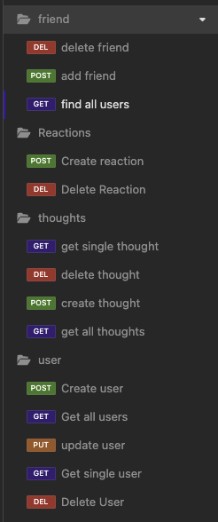

For more information on MIT visit https://opensource.org/licenses/MIT

# Social-NetworkDB

## Description

This project is part of a template that uses technologies commonly used in the development of full-stack social networking applications. It focuses on building the foundational API for a social network web application.

It uses MongoDB a popular choice for many social networks due to its speed with large amounts of data and flexibility with unstructured data.

## Table of Contents

- [Installation](#installation)
- [Usage](#usage)
- [Technologies Used](#technologies-used)
- [Features](#features)
- [Credits](#credits)
- [License](#license)

## Installation

To get started
1. clone the repository
* `git clone <repo url>`
2. Install the dependencies
* `npm install`
3. Start the server
* `npm start`
## Usage

This project is a template for a backend-focused social network. As a result, it does not include a front-end. Therefore, it is highly recommended to use tools like Postman or Insomnia to serve as the front-end.

It is still possible to use the browser to make requests.

Both methods use the api routes in order to make the requests.

### Technologies Used

* <a href="https://expressjs.com/">Express.js</a>: A fast, unopinionated, and minimalist web framework for Node.js.
* <a href="https://www.mongodb.com/">MongoDB</a>: A popular NoSQL database known for its flexibility and scalability.
* <a href="https://mongoosejs.com/docs/">Mongoose</a>: An elegant MongoDB object modeling tool designed to work in an asynchronous environment.

## Features

- Create, Update, View, and Delete Users.
- Create, Update, View, and Delete Thoughts.
- Create, and Delete Reactions.
- Add, and Delete Friends.

## Credits

Ask BCS - help with general info.

<a href="https://developer.mozilla.org/en-US/">MDN docs</a>

<a href="https://mongoosejs.com/docs/">Mongoose docs</a>

## License

MIT License

Copyright (c) 2023 Daniel A Zarate

Permission is hereby granted, free of charge, to any person obtaining a copy
of this software and associated documentation files (the "Software"), to deal
in the Software without restriction, including without limitation the rights
to use, copy, modify, merge, publish, distribute, sublicense, and/or sell
copies of the Software, and to permit persons to whom the Software is
furnished to do so, subject to the following conditions:

The above copyright notice and this permission notice shall be included in all
copies or substantial portions of the Software.

THE SOFTWARE IS PROVIDED "AS IS", WITHOUT WARRANTY OF ANY KIND, EXPRESS OR
IMPLIED, INCLUDING BUT NOT LIMITED TO THE WARRANTIES OF MERCHANTABILITY,
FITNESS FOR A PARTICULAR PURPOSE AND NONINFRINGEMENT. IN NO EVENT SHALL THE
AUTHORS OR COPYRIGHT HOLDERS BE LIABLE FOR ANY CLAIM, DAMAGES OR OTHER
LIABILITY, WHETHER IN AN ACTION OF CONTRACT, TORT OR OTHERWISE, ARISING FROM,
OUT OF OR IN CONNECTION WITH THE SOFTWARE OR THE USE OR OTHER DEALINGS IN THE
SOFTWARE.
